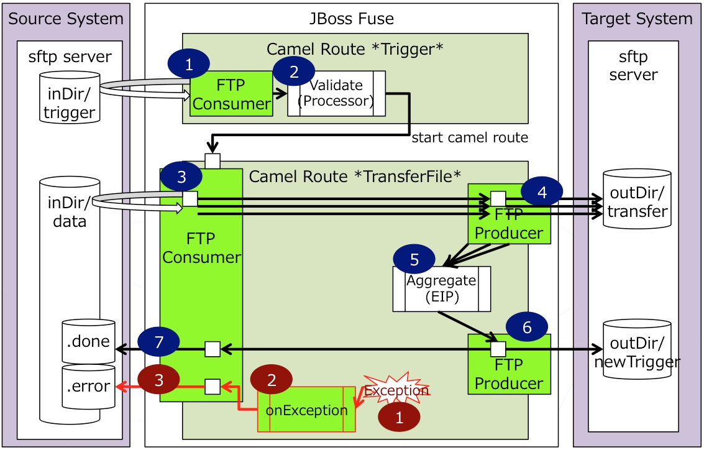
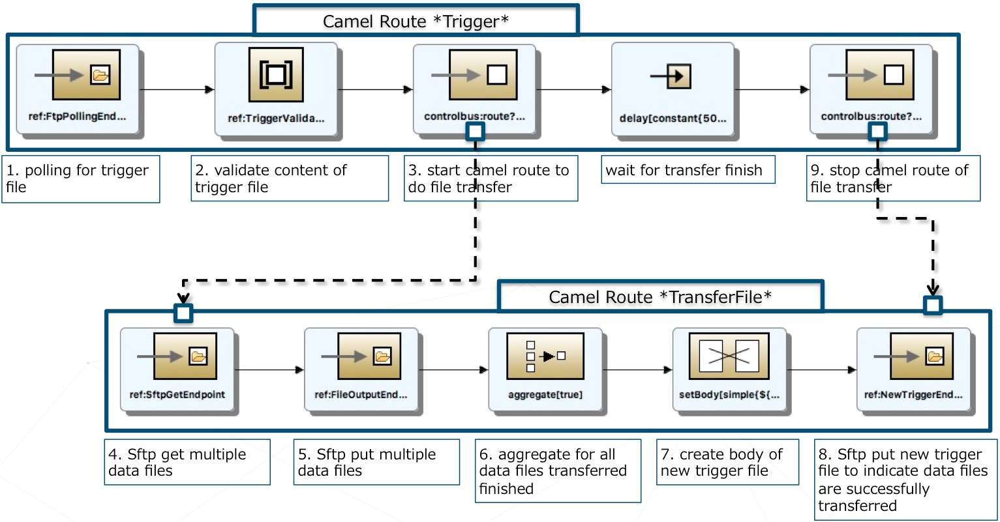

# sample-fuse-file-transfer
Demonstrate how to use JBoss Fuse as file transfer hub

HIGHLIGHTS
- Integration triggered by trigger file on remote SFTP Server
- Transfer multiple files then create a new trigger file to notify target system that data file are ready
- Using camel-sftp and and local work dir to avoid overhead for big size file
- Using JBoss Fuse BOM in pom.xml, so that easy to migrate new version of fuse
- Divided customer configuration in perperties.xml, so that easy to modify
- Separate definition portion of Endpoint in CamelRoute.xml, so that simplified route definition part


## INTEGRATION OVERVIEW



- Camel Route *Trigger* monitors file “test.trg” is created in “inDir/trigger”. If file exists, read file content and validate that file body is same as System date in format “YYYYMMDD”. Then start another camel route *TransferFile* to do real transfer of data files.
- Camel Route *TransferFile* pulls all data files in “inDir/data” and sftp them one by one into “outDir/transfer”. Aggregator will wait all files are transferred finished, then create a new trigger file to notify target system that data has been transferred. 

## CAMEL ROUTE IN DETAIL



- ***src/main/resources/OSGI-INF/blueprint***
   - *CamelRoute.xml* 
      Implementation of above 2 camel routes.
   - *processor.xml* 
      Declaration of processors used in camel route.(Can be merged into CamelRoute.xml)
   - *properties.xml* 
      Definition of properties used in camel route.(Should be updated to fit customers environment)
- ***src/main/java/com.sample***
   - *AwareEndAggregationStrategy.java*
      Strategy class for aggregate multiple data file processing against single trigger file.  
   - *TriggerValidationProcessor.java*
      Processor class to implement business logic like validation the content of trigger file.


## HOW TO RUN

To build this project use

    mvn install

To setup the sftp connection
>NOTE: If your public/private rsa key pair already exists in ~/.ssh/id_rsa and your public rsa key already be copied to sftp Server, you can skip this step.

```sh
ssh-keygen -t rsa
ssh-copy-id -i .ssh/id_rsa.pub test@localhost
```


To run the project you can execute the following Maven goal

    mvn camel:run

To deploy the project in OSGi. For example using JBoss Fuse
or Apache Karaf. You can run the following command from its shell:

```sh
osgi:install -s mvn:com.sample/filetransfer/0.0.1-SNAPSHOT
--- or ---
osgi:install -s file:/target/filetransfer-0.0.1-SNAPSHOT.jar
```


After that, prepare test data on sftp server like below to kick start

```sh
ssh test@localhost
mkdir -p inDir/data
mkdir -p inDir/trigger
echo test1 > inDir/data/file1.dat
echo test2 > inDir/data/file2.dat
echo `date '+%Y%m%d'` > inDir/trigger/test.trg
```	

Confirm the result

```sh
ssh test@localhost
tree -a inDir/
tree -a outDir/
```	

Sample result before file transfer
```sh
MBP-jfeng:~ test$ tree -a inDir/
inDir/
├── data
│   ├── .done
│   ├── .error
│   ├── file1.dat
│   └── file2.dat
└── trigger
    └── test.trg
```

Sample result after file transfer
```sh
MBP-jfeng:~ test$ tree -a inDir/
inDir/
├── data
│   ├── .done
│   │   ├── file1.dat
│   │   └── file2.dat
│   ├── .error
└── trigger

MBP-jfeng:~ test$ tree -a outDir/
outDir/
├── newTrigger
│   └── newTrigger-20160119-134537.552.trg
└── transferedData
    ├── file1.dat.20160119-134537.227
    └── file2.dat.20160119-134537.445
```

> NOTE: If any error occured, the original files will be moved to inDir/data/.error

## MORE

For more help see the Apache Camel documentation

    http://www.jboss.org/products/fuse/overview/
